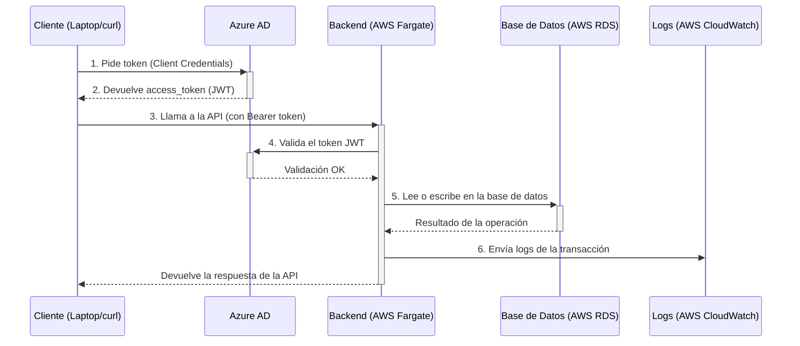

# Backend de Aprobaciones (API)

Servicio REST para gestionar solicitudes de aprobación genérica dentro del Banco de Bogotá. Está construido con Spring Boot 3 (Java 21), protegido con OAuth2/JWT (Azure AD), persiste en PostgreSQL (RDS) y se despliega en AWS ECS Fargate.

## ¿Qué hace esta API?

Esta API expone un sistema para crear, consultar y gestionar flujos de aprobación. El ciclo de vida básico es:

1.  Un **solicitante** crea una petición y se la asigna a un **aprobador**.
2.  El **aprobador** recibe la petición en su "bandeja de entrada" (inbox).
3.  El **aprobador** puede aprobar o rechazar la solicitud, añadiendo comentarios.
4.  Todo el proceso queda registrado en un historial de auditoría.

## Inicio Rápido

Sigue estos 3 pasos para interactuar con la API.

### Paso 1: Obtener un Token de Acceso

La API está protegida. Necesitas un `access_token` de Azure AD para hacer cualquier llamada.

> **Nota**: El siguiente script requiere la herramienta `jq` para procesar la respuesta JSON.

```sh
# Completa estas variables con las credenciales del App Registration en Azure AD
TENANT_ID="xxxxxxxx-xxxx-xxxx-xxxx-xxxxxxxxxxxx"
CLIENT_ID="xxxxxxxx-xxxx-xxxx-xxxx-xxxxxxxxxxxx"
CLIENT_SECRET="<secreto>"
API_SCOPE="api://<GUID-DEL-API>/.default"

# Ejecuta este comando para obtener el token
TOKEN=$( \
  curl -s -X POST "https://login.microsoftonline.com/${TENANT_ID}/oauth2/v2.0/token" \
    -H "Content-Type: application/x-www-form-urlencoded" \
    --data-urlencode "client_id=${CLIENT_ID}" \
    --data-urlencode "client_secret=${CLIENT_SECRET}" \
    --data-urlencode "scope=${API_SCOPE}" \
    --data-urlencode "grant_type=client_credentials" \
  | jq -r .access_token
)

echo "TOKEN: ${TOKEN:0:20}..."
```

> **⚠️ Error común**: Si el backend responde `401 invalid_token` con el error “The aud claim is not valid”, verifica que la variable de entorno `OAUTH_AUDIENCE` en el backend sea **SOLO** el GUID del API (sin el prefijo `api://`).

### Paso 2: Configurar el Entorno

Exporta las siguientes variables para simplificar los ejemplos.

```sh
# El token que obtuviste en el paso anterior
export TOKEN="..."

# Host y puerto del API (local o remoto vía túnel SSM)
export BASE="http://127.0.0.1:8081" 

# (Opcional) alias para jq para formatear la salida JSON
export JQ="jq ."
```

### Paso 3: ¡Probar la API!

Ahora puedes hacer llamadas a los endpoints. Por ejemplo, para ver tu bandeja de entrada de aprobaciones:

```sh
# GET /api/requests/inbox  => Devuelve un array con tus aprobaciones pendientes
curl -s \
  -H "Authorization: Bearer ${TOKEN}" \
  -H "Accept: application/json" \
  "${BASE}/api/requests/inbox" | $JQ
```

## Endpoints de la API

-   **Prefijo**: `/api`
-   **Autenticación**: `Bearer JWT` (Azure AD).
-   **Content-Type**: `application/json`.

| Método | Ruta | Descripción | Códigos Comunes |
| :--- | :--- | :--- | :--- |
| GET | `/requests/inbox` | Bandeja de entrada del aprobador autenticado. | 200 |
| GET | `/requests/outbox` | Solicitudes creadas por el usuario autenticado. | 200 |
| GET | `/requests/{id}` | Detalle de una solicitud específica. | 200, 404 |
| GET | `/requests/{id}/history` | Historial de acciones de una solicitud. | 200 |
| POST | `/requests` | Crear una nueva solicitud de aprobación. | 201 |
| POST | `/requests/{id}/approve` | Aprobar una solicitud pendiente. | 200, 409 |
| POST | `/requests/{id}/reject` | Rechazar una solicitud pendiente. | 200, 409 |
| POST | `/requests/{id}/comments` | Añadir un comentario a una solicitud. | 201 |
| DELETE | `/requests/{id}` | Eliminar una solicitud (rol de admin). | 204 |
| GET | `/actuator/health` | Health check del servicio. | 200 |

## Ejemplos de Uso (cURL)

A continuación se muestra un flujo de trabajo completo.

### 1. Crear una Solicitud

```sh
# POST /api/requests  => 201 { id, ... }
curl -sS -o /tmp/create.json -w "HTTP %{http_code}\n" \
  -H "Authorization: Bearer ${TOKEN}" \
  -H "Content-Type: application/json" \
  -X POST "${BASE}/api/requests" \
  -d '{
        "title":"Demo desde Fargate",
        "description":"Probando túnel SSM",
        "approverUpn":"aprobador@ynova.onmicrosoft.com",
        "type":"GENERAL"
      }'

# Guarda el ID para los siguientes pasos
REQ_ID=$(jq -r .id /tmp/create.json)
echo "REQ_ID=${REQ_ID}"
```

### 2. Consultar la Solicitud por ID

```sh
curl -s \
  -H "Authorization: Bearer ${TOKEN}" \
  -H "Accept: application/json" \
  "${BASE}/api/requests/${REQ_ID}" | $JQ
```

### 3. Aprobar o Rechazar

El aprobador (`aprobador@ynova.onmicrosoft.com` en este ejemplo) debe usar su propio token para estas acciones.

```sh
# Aprobar (con un comentario opcional)
curl -sS -w "HTTP %{http_code}\n" \
  -H "Authorization: Bearer ${TOKEN_APROBADOR}" \
  -H "Content-Type: application/json" \
  -X POST "${BASE}/api/requests/${REQ_ID}/approve" \
  -d '{"comment": "Aprobado por pruebas"}'

# Rechazar (con un comentario obligatorio)
curl -sS -w "HTTP %{http_code}\n" \
  -H "Authorization: Bearer ${TOKEN_APROBADOR}" \
  -H "Content-Type: application/json" \
  -X POST "${BASE}/api/requests/${REQ_ID}/reject" \
  -d '{"comment": "Rechazado por pruebas"}'
```

### 4. Añadir Comentarios

```sh
curl -sS -w "HTTP %{http_code}\n" \
  -H "Authorization: Bearer ${TOKEN}" \
  -H "Content-Type: application/json" \
  -X POST "${BASE}/api/requests/${REQ_ID}/comments" \
  -d '{"comment":"Comentario de prueba"}'
```

### 5. Consultar el Historial

```sh
curl -s \
  -H "Authorization: Bearer ${TOKEN}" \
  -H "Accept: application/json" \
  "${BASE}/api/requests/${REQ_ID}/history" | $JQ
```

### 6. Eliminar la Solicitud

```sh
# Solo permitido para roles específicos
curl -i \
  -H "Authorization: Bearer ${TOKEN}" \
  -X DELETE "${BASE}/api/requests/${REQ_ID}"
```

## Arquitectura y Despliegue (AWS)

-   **Aplicación**: Spring Boot 3.3.x, Tomcat embebido (HTTP :8080), perfiles `postgres` + `aad`.
-   **Base de datos**: PostgreSQL (AWS RDS). Migraciones con Flyway.
-   **Despliegue**: AWS ECS Fargate (`awsvpc`), 1–N réplicas, logs en CloudWatch.
-   **Observabilidad**: `/actuator/health`, logs estructurados.



## Autenticación y Seguridad (Azure AD)

La API actúa como **Resource Server** y valida tokens JWT emitidos por un Tenant de Azure AD.

-   **Issuer configurado en backend**:
    -   `OAUTH_ISSUER=https://login.microsoftonline.com/${TENANT_ID}/v2.0`
-   **Audience esperado por el backend**:
    -   `OAUTH_AUDIENCE=${API_AUDIENCE_ID}` (solo el GUID, sin `api://`).
-   **Scope para pedir el token**:
    -   `scope=api://${API_AUDIENCE_ID}/.default`

La API soporta dos flujos de autenticación:

1.  **Flujo Client Credentials (Servicio a Servicio)**: Usado por clientes automatizados. El token representa a la aplicación cliente, no a un usuario.
2.  **Flujo de Código de Autorización + PKCE (para UI/SPA)**: Flujo estándar para aplicaciones de usuario final (React, Angular, etc.). El token representa al usuario que ha iniciado sesión.

## Configuración y Desarrollo

### Variables de Entorno

La aplicación se configura con las siguientes variables de entorno:

```sh
# Perfiles de Spring
SPRING_PROFILES_ACTIVE=postgres,aad

# Base de datos
SPRING_DATASOURCE_URL=jdbc:postgresql://<rds-endpoint>:5432/<db>
SPRING_DATASOURCE_USERNAME=<usuario>
SPRING_DATASOURCE_PASSWORD=<password>

# OAuth2 (Azure AD)
OAUTH_ISSUER=https://login.microsoftonline.com/<TENANT_ID>/v2.0
OAUTH_AUDIENCE=<GUID-DEL-API> # sin api://

# CORS
CORS_ALLOWED_HEADERS=Authorization,Content-Type
```

### Ejecución Local

**Requisitos**: Java 21, Maven/Gradle, acceso a PostgreSQL y credenciales de Azure AD.

```sh
# 1. Exporta las variables de entorno
export SPRING_PROFILES_ACTIVE=postgres,aad
# ...y el resto de variables

# 2. Construye y ejecuta
./mvnw clean package
java -jar target/*-SNAPSHOT.jar
```

### Acceso para Pruebas en AWS (Túnel SSM)

Para probar la API en AWS sin exponerla a internet, se usa un túnel a través de AWS Systems Manager.

```sh
# 1. Obtener la IP privada del task de ECS
TASK_IP=$(...) # Script para obtener la IP

# 2. Abrir el túnel: 127.0.0.1:8081 -> TASK_IP:8080
aws ssm start-session \
--target <instance-id-del-bastion> \
--document-name AWS-StartPortForwardingSessionToRemoteHost \
--parameters "host=${TASK_IP},portNumber=8080,localPortNumber=8081"

# 3. Ahora puedes usar http://127.0.0.1:8081 como BASE
```

## Roadmap (Sugerencias)

-   [ ] **Autorización Fina**: Implementar validación de roles de Azure AD.
-   [ ] **Paginación y Filtrado**: Añadir paginación a los endpoints de listado.
-   [ ] **Gestión de Secretos**: Migrar secretos a AWS Secrets Manager.
-   [ ] **Notificaciones**: Integrar notificaciones por correo.

---
*Contacto técnico: ynova1@bancodebogota.com.co.*
